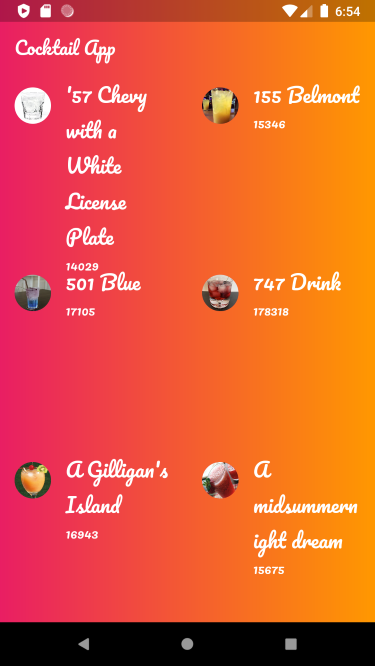

# Cocktail App
It is an useless app to be honest. But for people like me who know nothing about flutter it is a good way to start with. Lol! I used the API https://www.thecocktaildb.com/api/json/v1/1/search.php?i=vodka from https://www.thecocktaildb.com/api.php to get access to the database about cocktails. It is a basic application which refers to the use of API and basic animations.

